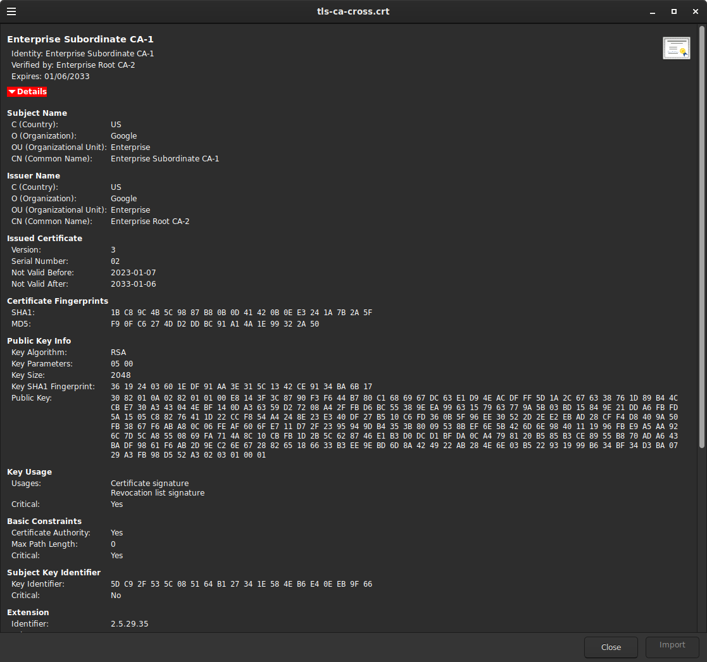

### Cross Signed Subordinate CA


See: [Cross-Signing and Alternate Trust Paths; How They Work](https://scotthelme.co.uk/cross-signing-alternate-trust-paths-how-they-work/)

## Create CA-1

```bash
mkdir -p ca/root-ca-1/private ca/root-ca-1/db crl certs
chmod 700 ca/root-ca-1/private
cp /dev/null ca/root-ca-1/db/root-ca-1.db
cp /dev/null ca/root-ca-1/db/root-ca.db-1.attr

echo 01 > ca/root-ca-1/db/root-ca-1.crt.srl
echo 01 > ca/root-ca-1/db/root-ca-1.crl.srl

openssl genpkey -algorithm rsa -pkeyopt rsa_keygen_bits:2048 \
      -pkeyopt rsa_keygen_pubexp:65537 -out ca/root-ca-1/private/root-ca-1.key

openssl req -new  -config root-ca.conf  -key ca/root-ca-1/private/root-ca-1.key \
   -out ca/root-ca-1.csr  

openssl ca -selfsign     -config root-ca.conf  \
   -in ca/root-ca-1.csr     -out ca/root-ca-1.crt  \
   -extensions root_ca_ext

openssl x509 -in ca/root-ca-1.crt -text -noout  


mkdir crl/
openssl ca -gencrl     -config root-ca.conf     -out crl/root-ca-1.crl
openssl crl -in crl/root-ca-1.crl -noout -text


### Create subordinate CA

mkdir -p ca/tls-ca-1/private ca/tls-ca-1/db crl certs
chmod 700 ca/tls-ca-1/private

cp /dev/null ca/tls-ca-1/db/tls-ca-1.db
cp /dev/null ca/tls-ca-1/db/tls-ca-1.db.attr
echo 01 > ca/tls-ca-1/db/tls-ca-1.crt.srl
echo 01 > ca/tls-ca-1/db/tls-ca-1.crl.srl

openssl genpkey -algorithm rsa -pkeyopt rsa_keygen_bits:2048 \
      -pkeyopt rsa_keygen_pubexp:65537 -out ca/tls-ca-1/private/tls-ca-1.key

openssl req -new  -config tls-ca.conf -key ca/tls-ca-1/private/tls-ca-1.key \
   -out ca/tls-ca-1.csr

openssl ca \
    -config root-ca.conf \
    -in ca/tls-ca-1.csr \
    -out ca/tls-ca-1.crt \
    -extensions signing_ca_ext

openssl ca -gencrl \
    -config tls-ca.conf \
    -out crl/tls-ca-1.crl

openssl crl -in crl/tls-ca-1.crl -noout -text


## create a server and client certificate
export NAME=server
export SAN=DNS:server.domain.com
openssl req -new     -config server.conf \
  -out certs/$NAME.csr   \
  -keyout certs/$NAME.key \
  -subj "/C=US/O=Google/OU=Enterprise/CN=server.domain.com"

openssl ca \
    -config tls-ca.conf \
    -in certs/$NAME.csr \
    -out certs/$NAME.crt \
    -extensions server_ext


export NAME=client
export SAN=DNS:client.domain.com
openssl req -new \
    -config client.conf \
    -out certs/$NAME.csr \
    -keyout certs/$NAME.key \
    -subj "/C=US/O=Google/OU=Enterprise/CN=client@domain.com"

openssl ca \
    -config tls-ca.conf \
    -in certs/$NAME.csr \
    -out certs/$NAME.crt \
    -policy extern_pol \
    -extensions client_ext

```

## Create CA-2

```bash
mkdir -p ca/root-ca-2/private ca/root-ca-2/db crl certs
chmod 700 ca/root-ca-2/private
cp /dev/null ca/root-ca-2/db/root-ca-2.db
cp /dev/null ca/root-ca-2/db/root-ca.db-1.attr

echo 01 > ca/root-ca-2/db/root-ca-2.crt.srl
echo 01 > ca/root-ca-2/db/root-ca-2.crl.srl

openssl genpkey -algorithm rsa -pkeyopt rsa_keygen_bits:2048 \
      -pkeyopt rsa_keygen_pubexp:65537 -out ca/root-ca-2/private/root-ca-2.key

openssl req -new  -config root-ca.conf  -key ca/root-ca-2/private/root-ca-2.key \
   -out ca/root-ca-2.csr  

openssl ca -selfsign     -config root-ca.conf  \
   -in ca/root-ca-2.csr     -out ca/root-ca-2.crt  \
   -extensions root_ca_ext

openssl x509 -in ca/root-ca-2.crt -text -noout  

mkdir crl/
openssl ca -gencrl     -config root-ca.conf     -out crl/root-ca-2.crl
openssl crl -in crl/root-ca-2.crl -noout -text

```

### CrossSign 

Use `CA-2` to sign the CSR for the subordinate CA from `CA-1`

```bash
cp ../CA_1/ca/tls-ca-1.csr ca/

openssl ca \
    -config root-ca.conf \
    -in ca/tls-ca-1.csr \
    -out ca/tls-ca-cross.crt \
    -extensions signing_ca_ext
```


### Verify Trust chains

```bash
$ openssl verify -show_chain  -verbose -CAfile <(cat tls-ca-1.crt root-ca-1.crt) server.crt
server.crt: OK
Chain:
depth=0: C = US, O = Google, OU = Enterprise, CN = server.domain.com (untrusted)
depth=1: C = US, O = Google, OU = Enterprise, CN = Enterprise Subordinate CA-1
depth=2: C = US, O = Google, OU = Enterprise, CN = Enterprise Root CA-1

$ openssl verify -show_chain -verbose -CAfile <(cat tls-ca-cross.crt root-ca-2.crt) server.crt
server.crt: OK
Chain:
depth=0: C = US, O = Google, OU = Enterprise, CN = server.domain.com (untrusted)
depth=1: C = US, O = Google, OU = Enterprise, CN = Enterprise Subordinate CA-1
depth=2: C = US, O = Google, OU = Enterprise, CN = Enterprise Root CA-2

## notice the public certs are the same for the cross signed sub-ca
$ openssl x509 -pubkey -noout -in tls-ca-cross.crt 
-----BEGIN PUBLIC KEY-----
MIIBIjANBgkqhkiG9w0BAQEFAAOCAQ8AMIIBCgKCAQEA6BQ/PIeQ8/ZEt4DBaGln
3GPh2U6s3/9dGixnYzh2HYm0TMvnMKNDBE6/FA2jY1nScgikL/vWvFU4nuqZYxV5
Y3eaWwO9FYSeId2m+/1aFQXIgnZBHSLM+FSkJI4j40DfJ7UQxv02C1+W7jBSLS7i
660oz/TYQJpQ+zhn9quoDAb+r2Bv5xHXLyOVlJ20NTuACVOL725bQm1umEARGZb7
6aWqkmx9XKhVCGn6cUqMEMv7HStcYodG4bPQ3NG/2gykeYEgtYWzzolVuHCtpkO6
35hh9qstnsJuZyiCZRhmM7Punr1tikJJIqsoTm4DtSKTGZm2NL8007oHKaP7mNVS
owIDAQAB
-----END PUBLIC KEY-----

$ openssl x509 -pubkey -noout -in tls-ca-1.crt 
-----BEGIN PUBLIC KEY-----
MIIBIjANBgkqhkiG9w0BAQEFAAOCAQ8AMIIBCgKCAQEA6BQ/PIeQ8/ZEt4DBaGln
3GPh2U6s3/9dGixnYzh2HYm0TMvnMKNDBE6/FA2jY1nScgikL/vWvFU4nuqZYxV5
Y3eaWwO9FYSeId2m+/1aFQXIgnZBHSLM+FSkJI4j40DfJ7UQxv02C1+W7jBSLS7i
660oz/TYQJpQ+zhn9quoDAb+r2Bv5xHXLyOVlJ20NTuACVOL725bQm1umEARGZb7
6aWqkmx9XKhVCGn6cUqMEMv7HStcYodG4bPQ3NG/2gykeYEgtYWzzolVuHCtpkO6
35hh9qstnsJuZyiCZRhmM7Punr1tikJJIqsoTm4DtSKTGZm2NL8007oHKaP7mNVS
owIDAQAB
-----END PUBLIC KEY-----

```





### mTLS with golang

the `http_mtls/` folder contains a sample client/server which uses the full chain set of `CA-1`, `CA-2` and the cross signed set

to use

```
/etc/hosts

127.0.0.1 server.domain.com
```

```bash
# server

go run server/main.go

go run client/main.go
```
